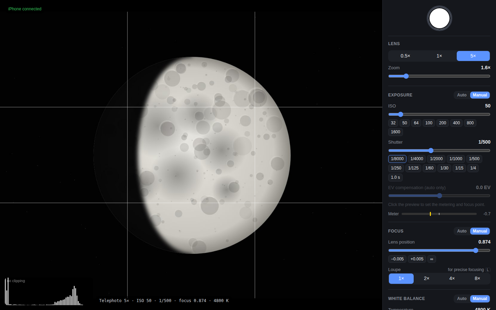
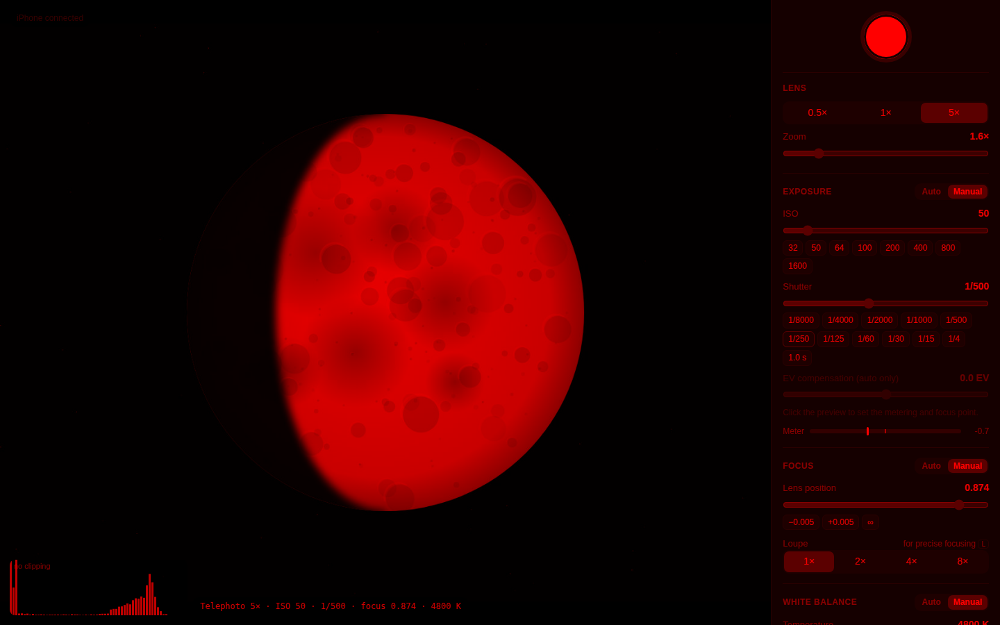

<div align="center">

# 🌕 Remote Camera

**Turn your iPhone into a fully manual, remotely controlled camera — and shoot the Moon from your MacBook.**

Put the phone on a tripod, open a browser on your Mac, and control ISO, shutter speed, focus,
white balance and lenses with a live preview. No touching the phone, no shake, no Mac app to install.

[](https://github.com/flywalk4/remote-camera/actions/workflows/ci.yml)




</div>

---

## Why

Phone cameras are great — until you point one at the Moon. Auto exposure turns it into a white blob,
autofocus hunts in the dark sky, and every tap on the screen shakes the tripod.

**Remote Camera** fixes all three:

- 🎛 **Full manual control** — ISO, shutter speed, focus distance and white balance, locked exactly where you set them.
- 🖥 **Hands off** — everything is driven from your Mac's browser, so the phone never moves.
- 🔭 **Made for the night sky** — telephoto lens, focus loupe, clipping histogram, RAW, burst series for stacking, red night mode.

## ✨ Features

| | |
|---|---|
| 🎚 **Manual exposure** | ISO and shutter via log-scale sliders or one-click presets (1/8000 … 1 s), exposure meter, EV compensation in auto |
| 🎯 **Precise focus** | Lens position in 0.001 steps, `[` `]` nudges, **2×/4×/8× loupe** at full sensor resolution, click-to-focus |
| 🔭 **Every lens** | Ultra wide / wide / **telephoto** (whatever your iPhone has) + digital zoom |
| 🌡 **White balance** | Auto or manual temperature & tint |
| 📸 **RAW & ProRAW** | HEIF, JPEG, **RAW (DNG)**, Apple ProRAW, up to **48 MP** |
| 🔁 **Series for stacking** | N frames at a set interval, with a pre-shot delay so the tripod settles |
| 📊 **Histogram** | Live brightness histogram with a clipping warning |
| 🌕 **Moon preset** | One click: longest lens, ISO 50, 1/250 s, RAW |
| 🔴 **Night mode** | Red-only UI on the Mac and a blacked-out phone screen to keep your eyes dark-adapted |
| 🔒 **Settings stay put** | If iOS silently resets exposure or focus, the app restores your values instantly |
| ⬇️ **Instant download** | Photos go straight from the phone to your Mac's browser; optionally also to Photos |
| 🔋 **Phone status** | Battery and overheating shown on the remote |
| 📱 **On-phone controls too** | Lens, ISO, shutter and focus are also on the iPhone screen, synced with the Mac |

<div align="center">

<br><sub>Red night mode — easy on dark-adapted eyes</sub>
</div>

<!--
## 📷 Shot with Remote Camera

-->

## 🚀 Quick start (≈10 minutes)

**You need:** a Mac with Xcode 15+, an iPhone on iOS 15+, a USB cable, and a free Apple ID.
No paid developer account required.

```bash
git clone -b claude/vigilant-fermat-af9osn https://github.com/flywalk4/remote-camera.git
cd remote-camera
brew install xcodegen && xcodegen
open RemoteCamera.xcodeproj
```

1. In Xcode: **RemoteCamera** target → **Signing & Capabilities** → **Team** → your Apple ID.
   If the bundle ID is taken, change `com.example.remotecamera` to e.g. `com.yourname.remotecamera`.
2. Plug in the iPhone, pick it at the top of the Xcode window, press **▶︎**.
3. On the iPhone: trust your certificate in **Settings → General → VPN & Device Management**
   (and turn on **Developer Mode** on iOS 16+ if asked). Allow **Camera** and **Local Network**.
4. The app shows an address like `http://192.168.1.23:8080` — **open it in Safari or Chrome on your Mac.** Done! 🎉

> **No Wi-Fi outdoors?** Turn on **Personal Hotspot** on the iPhone, join it from the Mac and open
> `http://172.20.10.1:8080`.

<details>
<summary>Without XcodeGen (create the project by hand)</summary>

1. Xcode → File → New → Project → iOS **App**, SwiftUI, Swift, name `RemoteCamera`.
2. Delete the generated `ContentView.swift` and `RemoteCameraApp.swift`, drag in everything from `RemoteCamera/`.
3. Drag in the `Web` folder as a **folder reference** (blue folder) with the target checked.
4. Build Settings: **iOS Deployment Target 15.0**, **Swift Language Version 5**.
5. Add the Info.plist keys listed under `info.properties` in [`project.yml`](project.yml).
</details>

> Apps signed with a free Apple ID run for 7 days — just press ▶︎ in Xcode again to renew.

## 🌕 Shooting the Moon — step by step

1. Click **🌕 Moon preset**.
2. Center the Moon (press `G` for a grid).
3. **Focus:** press `L` for the 4–8× loupe, switch focus to **Manual** and nudge with `[` `]` until the craters on
   the terminator (the light/shadow line) are razor sharp. iPhone "infinity" is rarely exactly 1.0 — trust your eyes.
4. **Exposure:** shorten the shutter until the histogram's *clipped* warning disappears — usually ISO 50–100 at
   1/250–1/2000 s. Slightly dark is better: RAW lifts shadows, but blown-out highlights are gone forever.
5. Set a **2 s delay** and a **series of 20–50 frames** at 0.5 s, press `Space`.
6. Hit **download all** and stack the DNGs in AutoStakkert!, Siril or RegiStax for a sharper, cleaner Moon.

**Tips:** a clip-on telephoto/binocular adapter works great — keep it clean and centered to avoid halos and ghost
reflections. The Moon drifts across the frame within minutes, so re-center between series.

## ⌨️ Keyboard shortcuts

| Key | Action | | Key | Action |
|---|---|---|---|---|
| `Space` | Shoot | | `L` | Loupe 1× → 2× → 4× → 8× |
| `Esc` | Stop a series | | `G` | Grid |
| `[` / `]` | Focus nearer / farther (`Shift` = bigger step) | | `H` | Histogram |
| | | | `N` | Red night mode |

## 📱 Supported iPhones

**Every iPhone that runs iOS 15 or later** — iPhone 6s, SE (all generations), 7, 8, X, XS, XR, 11, 12, 13, 14, 15,
16, 17 and all Plus/Pro/Max/mini models. The app adapts to the hardware and hides what your camera can't do:

| Feature | Available on |
|---|---|
| Manual ISO, shutter, focus, white balance, RAW (DNG) | all supported iPhones |
| HEIF | iPhone 7 and newer (older models shoot JPEG) |
| Telephoto lens (2×–5×) | Plus / X / XS / Pro models |
| Ultra wide lens | iPhone 11 and newer (except SE / XR) |
| Apple ProRAW | iPhone 12 Pro and newer Pro models |
| 48 MP + resolution switch | iPhone 14 Pro, 15 and newer |

The preview and the photos follow how the phone is standing (portrait or landscape) — detected with the
accelerometer, so it works even with rotation lock on.

## 🛠 How it works

```
 iPhone on a tripod (Remote Camera app)            MacBook (any browser)
┌───────────────────────────────────────┐        ┌───────────────────────────────┐
│ AVFoundation: fully manual camera      │ Wi-Fi  │ http://<iPhone IP>:8080       │
│ built-in HTTP server on port 8080 ─────┼───or──▶│ live MJPEG preview + histogram│
│ photos saved to Files → Remote Camera  │ Hotspot│ all settings, shutter, gallery│
└───────────────────────────────────────┘        └───────────────────────────────┘
```

Safari doesn't let websites control ISO, shutter speed or focus, so the camera side is a native Swift app.
It serves the remote itself — the Mac only needs a browser. Everything stays on your local network.

<details>
<summary>HTTP API (script your camera!)</summary>

| Method | Path | Description |
|---|---|---|
| GET | `/api/state` | Current camera parameters and their ranges |
| POST | `/api/settings` | Any subset of `{lens, zoom, exposureMode, iso, shutter, bias, focusMode, lensPosition, wbMode, temperature, tint, point:{x,y}, loupe}` |
| POST | `/api/capture` | `{format: heif\|jpeg\|raw\|proraw, count, interval, delay, saveToPhotos, resolution: max\|12mp}` |
| POST | `/api/cancel` | Stop a series |
| GET | `/api/photos` | List photos |
| GET | `/photos/<name>` | Download a photo (`?download=1` as attachment) |
| POST | `/api/photos/delete` | `{name}` |
| GET | `/stream` | MJPEG preview |

```bash
# 100 RAW frames, one per second
curl -X POST http://172.20.10.1:8080/api/capture -d '{"format":"raw","count":100,"interval":1}'
```
</details>

## 🧪 Tests

Every push runs [CI](.github/workflows/ci.yml) with two jobs:

| Suite | What it covers | Run locally |
|---|---|---|
| **Web remote** — 29 Playwright tests ([`tests/web`](tests/web/remote.spec.js)) | Connection & reconnect, preview & histogram, lenses, exposure (log sliders, presets, auto/manual), focus & loupe, click-to-focus mapping, white balance, Moon preset, series capture & cancel, per-model formats/resolution, gallery download & delete, shortcuts | `npm ci && npx playwright install chromium && npm test` |
| **iOS app** — 41 XCTest tests ([`RemoteCameraTests`](RemoteCameraTests)) | HTTP parser, the real server over the network, every API route, path-traversal protection, JSON models, photo storage, slider math, orientation mapping | Xcode → **⌘U** (any iPhone simulator) |

The web tests run against [`tests/web/mock-server.js`](tests/web/mock-server.js) — a mock of the iPhone API that
streams a synthetic Moon. Handy for hacking on the UI without a phone: `npm run mock` → http://localhost:8090.
`npm run screenshots` regenerates the images in this README.

## ❓ Troubleshooting

| Problem | Fix |
|---|---|
| The Mac can't open the address | Same Wi-Fi (or the iPhone's hotspot)? Is **Local Network** allowed for Remote Camera in iPhone Settings → Privacy & Security? Keep the app in the foreground. |
| The camera stops when the screen locks | iOS pauses the camera for background apps. The app disables auto-lock; use the 🌙 button to black out the screen instead of locking it. |
| Settings reset or the camera refocuses when shooting at max resolution | The app restores them immediately. If the photo itself is affected, set **Resolution → 12 MP** (or shoot RAW, which is always 12 MP). |
| The image is rotated | Orientation comes from the accelerometer; while the phone points straight up it keeps the last orientation. Tilt it briefly and it updates. |
| "Untrusted Developer" on the iPhone | Settings → General → VPN & Device Management → trust your Apple ID. |

## 📂 Project layout

```
project.yml                  XcodeGen project (app + unit tests)
RemoteCamera/                iOS app (SwiftUI + AVFoundation + Network.framework)
  CameraController.swift     lenses, manual settings, capture, series, preview, settings guard
  OrientationMonitor.swift   accelerometer-based orientation for preview and photos
  HTTPServer.swift           tiny HTTP/1.1 server and MJPEG stream
  WebAPI.swift               API routes for the remote
  ContentView.swift          iPhone screen
  CameraControlsView.swift   on-phone settings panel
  PhotoStore.swift           photo storage
  Models.swift               JSON models
Web/                         the browser remote (served by the app)
RemoteCameraTests/           XCTest unit & integration tests
tests/web/                   Playwright tests, mock iPhone API, screenshot script
```

## 🤝 Contributing

Issues and pull requests are welcome — especially photos taken with the app, results on different iPhone
models, and ideas for astrophotography features. Please run `npm test` (and ⌘U in Xcode for Swift changes)
before opening a PR.

<div align="center">

**Clear skies! 🔭**

</div>
